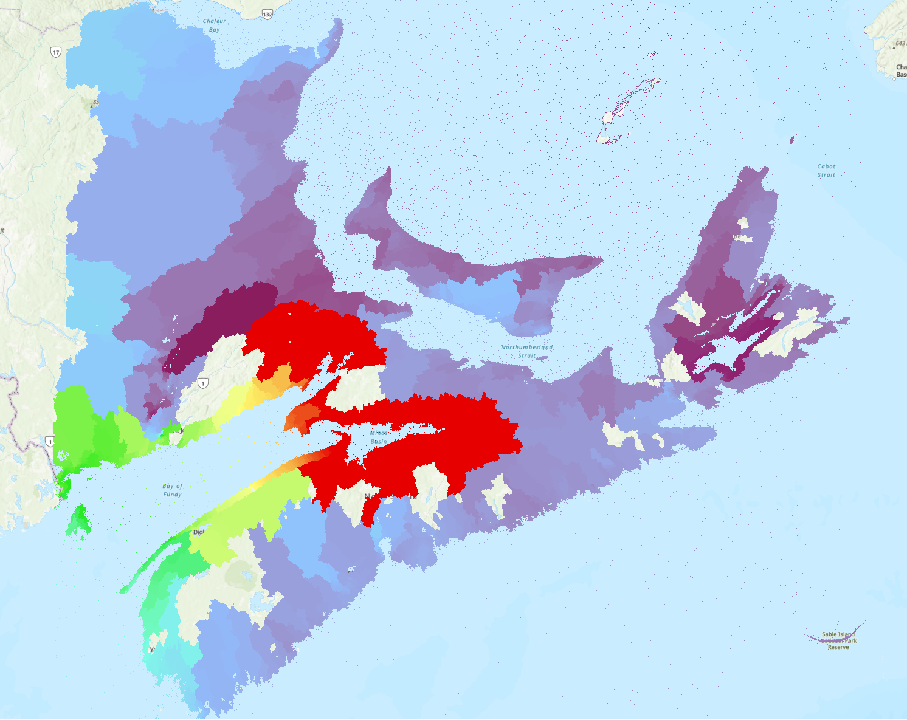
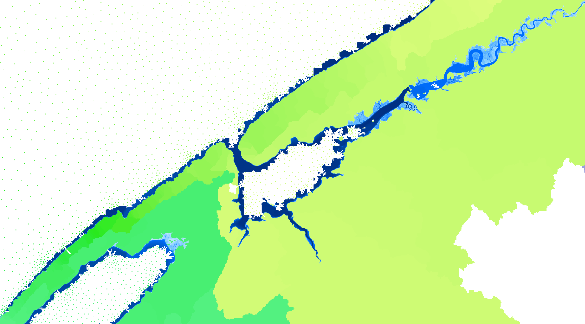

# SeaLink: Tide Constituent Linking Tool

*height above sea (rough, note that holes are unintentional)

## Introduction and Concept

SeaLink is a geospatial tool designed to standardize the influence of tidal offsets across varied topographies. It achieves this by 'linking' each inland point to its nearest oceanic point, providing a uniform tidal offset value. The primary aim is to offer a consistent frame of reference for tidal benchmarks such as Higher High Water Large Tide (HHWLT) or Lower Low Water Large Tide (LLWLT).

The geographical scope for this uniformity is defined by watersheds. A watershed delineates the area where all water drains to a single outlet point, often leading to the ocean. SeaLink uses this to ensure that all points within a given watershed are assigned the same tidal offset value. This is essential for simplifying the calculations used in tidal flood modeling.

Tidal offsets are values that convert a standard elevation point to a tidal reference, like HHWLT or LLWLT. These offsets are the actual 'link' between the oceanic tides and the inland topography. The foundational layer for SeaLink is an elevation model in a standard like CGVD2013. This model is used for both watershed delineation and the application of tidal offsets.

The resulting elevation model is then referenced to a tidal benchmark, making it invaluable for tidal flood modeling and resource management, especially in areas with complex tidal geography like the Bay of Fundy.

## Applications

SeaLink has broad applications in:

- Tidal Flood Modeling: For accurate flood predictions in areas with complex tidal distributions.
- Resource Management: For effective planning in regions susceptible to sea-level rise and tidal variations.

## Data Requirements

To operate SeaLink, the following data are essential:

- Tidal Offset Points: Typically sourced from CHS [HyVSEPs](https://www.researchgate.net/publication/299373222_Hydrographic_Vertical_Separation_Surfaces_HyVSEPs_for_the_Tidal_Waters_of_Canada#fullTextFileContent), these are required for converting CGVD2013 to HHWLT or LLWLT.
- Elevation Model: This should be in the CGVD2013 standard and can be sourced either from Canadian [HRDEM](https://open.canada.ca/data/en/dataset/957782bf-847c-4644-a757-e383c0057995) or provincial [GeoNova lidar](https://nsgi.novascotia.ca/datalocator/elevation/) DEM.

## Usage

To get started with SeaLink, clone the repository and install the required Python packages listed in the requirements.txt file. After that, run the main script with your elevation model and tidal offset points as arguments.

*the height above sea changes greater over short distances in the annapolis basin, NS

## Acknowledgments

(Any acknowledgments, citations, or resources that have contributed to the project can be mentioned here.)

